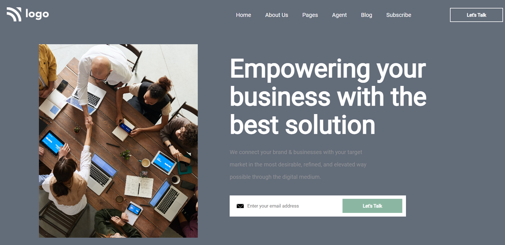

# Business Landing Page

  

 - I am Varun Gupta
 - In this project, I'll apply the learning of basic concepts of the HTML and CSS

## About Project

This is an average landing page of some business.
  
  - This web page consists of a simple navbar, main & footer.
  - This webpage has simple HTML properties like divs, etc. 

## Time Taken

It took me around 1.5 days for the project.

## Concepts learned

 - Applied flex display properties in navbar, footer & in many sections of the page.
 - Learned to write HTML in orderly manner and learned a way or two to reduce CSS. 